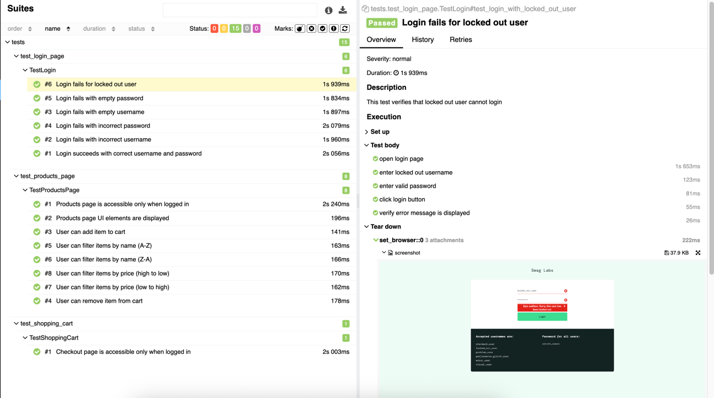
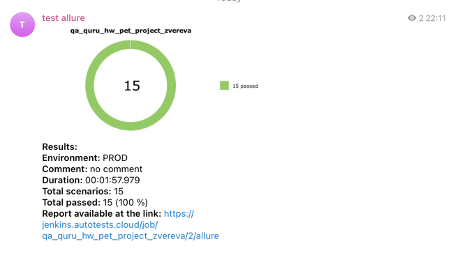

# Sauce Demo Test Automation
[https://www.saucedemo.com/](https://www.saucedemo.com/)

### Technology Stack
<p align="left">
  
  
  
  
  
  
</p>

### Project Description
Web application test automation for Sauce Demo using Selenium, Selene and pytest. The project includes testing of login functionality, product catalog, and shopping cart.

### Test Coverage
- **Login** - user authentication, error validation
- **Products Page** - product display, filtering, adding to cart
- **Shopping Cart** - cart management, item removal

### Environment Setup
Create a `.env` file in the project root before running tests:

1. Copy the example file: `cp .env.example .env`
2. Fill in the `.env` file with actual values for Selenoid access. Example:
```commandline
LOGIN=user1
PASSWORD=1234
```

### Install Dependencies
```commandline
pip install -r requirements.txt
```

### Running Tests

Run all tests:
```commandline
pytest tests
```

Run a specific test file:
```commandline
pytest tests/<test_file_name>
```

Run a specific test:
```commandline
pytest tests/<test_file_name>::<test_class_name>::<test_function_name>
```

Run with specific browser version:
```commandline
pytest tests --browser_version=128.0
```

Generate Allure report:
```commandline
allure serve allure-results
```

### Project Structure
```
qa_quru_saucedemo/
├── model/
│   ├── locators/          # Page element locators
│   └── pages/             # Page Object classes
├── tests/                 # Test scenarios
├── utils/                 # Utilities for Allure attachments
├── notifications/         # Notification configuration
├── conftest.py           # pytest fixtures
├── pytest.ini            # pytest configuration
└── requirements.txt      # Project dependencies
```

### Test Reports Examples

Jenkins remote execution:


Allure report overview page:


Test details page with browser logs, screenshot and video:



Telegram notification from bot:



### CI/CD
The project is integrated with Jenkins for automated test execution. Test results are sent to Telegram via Allure Notifications.

Jenkins Job: [https://jenkins.autotests.cloud/job/qa_quru_hw_pet_project_zvereva/](https://jenkins.autotests.cloud/job/qa_quru_hw_pet_project_zvereva/)